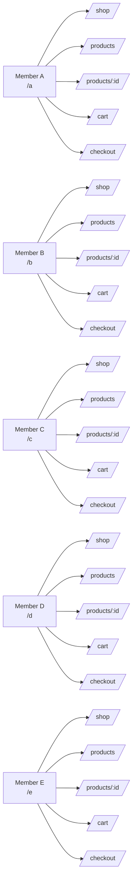

# Refood Web Admin (React + Vite)

Web app này được chia theo 5 namespace `a`, `b`, `c`, `d`, `e` để nhóm có thể làm song song và demo rõ ràng.

## Mục tiêu

- Mỗi member có đủ 5 trang:
  - `/a/shop`, `/a/products`, `/a/products/:id`, `/a/cart`, `/a/checkout`
  - `/b/shop`, `/b/products`, `/b/products/:id`, `/b/cart`, `/b/checkout`
  - tương tự cho `c`, `d`, `e`
- Product được chia theo category để lọc nhanh và dễ chấm bài.
- App dùng chung `shared/` cho component, store, constant; `features/` cho flow code.

## Cấu trúc thư mục

```text
src/
  app/
    router/
      index.jsx
      MemberGuard.jsx
      routePaths.js
  shared/
    constants/
      members.js
      categories.js
      mockProducts.js
  features/
    member-flow/
      pages/
        MemberShopPage.jsx
        MemberProductsPage.jsx
        MemberProductDetailPage.jsx
        MemberCartPage.jsx
    checkout/
      pages/
        CheckoutPage.jsx
  pages/
  components/
  stores/
```

### Ghi chú

- `app/` giữ router shell.
- `shared/` giữ dữ liệu/constant dùng chung.
- `features/` giữ page chính theo flow.
- `pages/`, `components/`, `stores/` cũ vẫn còn để đảm bảo tương thích với code hiện có; nhóm có thể di chuyển dần sang `features/` và `shared/` sau khi merge xong.

## Collaboration rules

### Branch gợi ý

```bash
feat/a-flow
feat/b-flow
feat/c-flow
feat/d-flow
feat/e-flow
```

### File chung chỉ 1 người owner

- `src/App.jsx`
- `src/main.jsx`
- `src/app/router/index.jsx`
- `src/app/router/MemberGuard.jsx`
- `src/stores/useCartStore.js`
- `src/stores/useProductStore.js`
- `src/components/common/SiteHeader.jsx`

### File member-owned

- `src/features/member-flow/pages/MemberShopPage.jsx`
- `src/features/member-flow/pages/MemberProductsPage.jsx`
- `src/features/member-flow/pages/MemberProductDetailPage.jsx`
- `src/features/member-flow/pages/MemberCartPage.jsx`
- `src/features/checkout/pages/CheckoutPage.jsx`

## Sơ đồ team flow



## Categories

Trang `products` có filter theo category:

- `Com`
- `BunPho`
- `MonChien`
- `DoUong`
- `TrangMieng`

Nếu backend chưa có product API, app sẽ dùng mock products để vẫn demo được full flow.

## Chạy nhanh

```bash
npm run dev
```


```bash
npm run build
```
